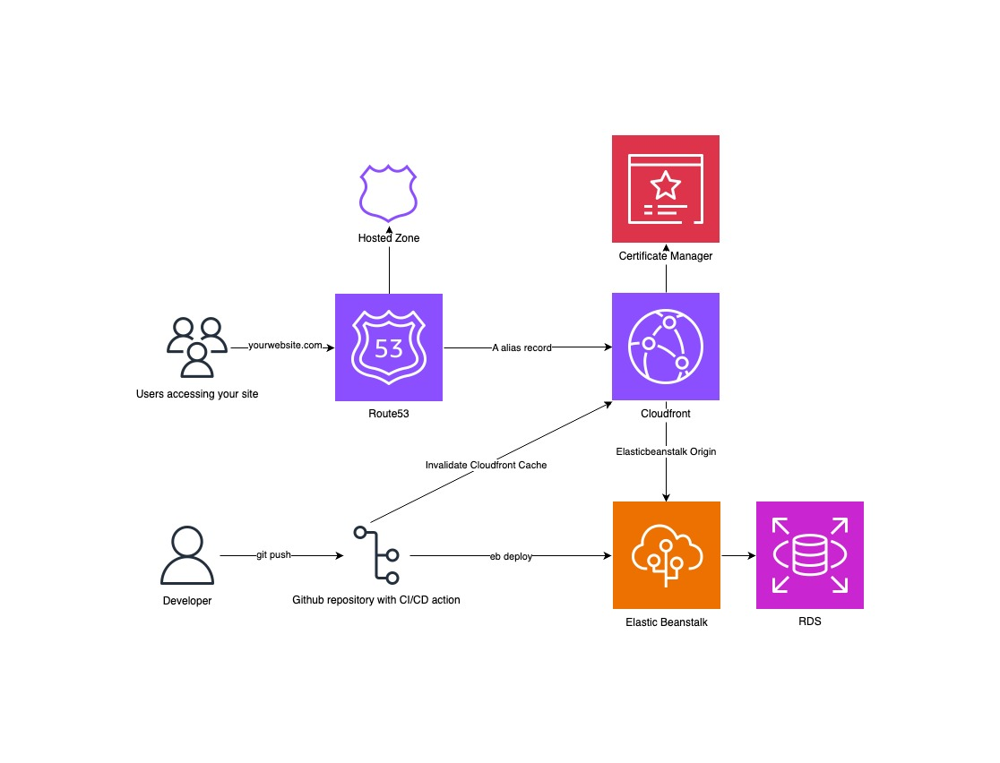

# HTMX Go Todo List

A modern, full-stack todo list application built with Go and HTMX, deployed on AWS infrastructure. This project demonstrates a server-side rendering approach with dynamic updates using HTMX, backed by AWS services for authentication, database, and hosting.



## Features

- ✅ Create, read, update, and delete tasks
- 🔒 User authentication via AWS Cognito
- 🎨 Dynamic UI updates without JavaScript frameworks (HTMX)
- 🗄️ MySQL database with type-safe queries (sqlc)
- ☁️ Cloud-native deployment on AWS (Elastic Beanstalk, RDS, CloudFront)
- 🔄 Hot reload for local development
- 🚀 Automated CI/CD pipeline

## Tech Stack

### Backend
- **Go 1.22** - Primary backend language
- **Gorilla Mux** - HTTP router
- **templ** - Type-safe Go templating engine
- **sqlc** - Type-safe SQL query generation
- **MySQL** - Database (AWS RDS)

### Frontend
- **HTMX** - Dynamic HTML updates
- Server-side rendered templates

### Infrastructure (AWS)
- **Elastic Beanstalk** - Application hosting
- **RDS MySQL** - Database
- **Cognito** - User authentication
- **CloudFront** - CDN
- **Route53** - DNS management
- **ACM** - SSL/TLS certificates
- **CDK (TypeScript)** - Infrastructure as Code

## Getting Started

### Prerequisites

**For Local Development:**
- Go 1.22+

**For Production Deployment:**
- Node.js 14+ (for CDK)
- Python 3.10+ (for AWS CLI and EB CLI)
- AWS CLI
- AWS CDK CLI
- EB CLI (Elastic Beanstalk)

### Quick Start (Simplest Method)

1. **Clone the repository**
   ```bash
   git clone https://github.com/7empestx/GoHTMXToDoList.git
   cd HTMX-golang-todo-list/GoApp
   ```

2. **Install Go dependencies**
   ```bash
   go mod tidy
   ```

3. **Run the server**
   ```bash
   go run cmd/server/main.go
   ```

4. **Access the application**
   - Local server: http://localhost:5000
   - Uses in-memory storage (no database setup required)
   - Data resets when server restarts

### Local Development (With Hot Reload)

1. **Install development tools**
   ```bash
   # Install templ (template engine)
   go install github.com/a-h/templ/cmd/templ@latest

   # Install air (hot reload) - optional but recommended
   go install github.com/air-verse/air@latest

   # Add Go bin to PATH
   export PATH=$PATH:$(go env GOPATH)/bin
   ```

2. **Run with hot reload**
   ```bash
   cd GoApp
   air
   ```
   - Access via http://localhost:8090 (Air proxy)
   - Auto-reloads on file changes (.go, .templ, .sql)

### Production Setup (With Database)

1. **Set up environment variables**

   For production with database and authentication:
   ```bash
   export RDS_HOSTNAME=your-db-host
   export RDS_DB_NAME=your-db-name
   export RDS_USERNAME=your-db-username
   export RDS_PASSWORD=your-db-password
   export COGNITO_USER_POOL_ID=your-user-pool-id
   export COGNITO_APP_CLIENT_ID=your-app-client-id
   export COGNITO_APP_CLIENT_SECRET=your-app-client-secret
   ```

2. **Build and run**
   ```bash
   templ generate
   go build -o bin/application cmd/server/main.go
   ./bin/application
   ```

## Project Structure

```
.
├── GoApp/                      # Go application
│   ├── cmd/server/            # Application entry point
│   ├── internal/
│   │   ├── app/               # App configuration
│   │   ├── auth/              # Cognito authentication
│   │   ├── db/                # Database connection and store
│   │   │   └── store/         # sqlc generated code
│   │   │       ├── schema/    # SQL schema definitions
│   │   │       ├── queries/   # SQL queries
│   │   │       └── sqlc/      # Generated Go code
│   │   ├── router/            # HTTP routes and handlers
│   │   │   ├── home/          # Todo list handlers
│   │   │   └── login/         # Authentication handlers
│   │   └── views/             # templ templates
│   ├── static/                # Static assets (CSS, JS)
│   ├── air.toml               # Hot reload configuration
│   ├── sqlc.yaml              # sqlc configuration
│   └── Procfile               # Elastic Beanstalk process file
├── cdk/                       # AWS CDK infrastructure
│   └── lib/
│       └── cdk-stack.ts       # CloudFormation stack definition
├── .github/workflows/         # CI/CD pipeline
└── recursiveBuild.sh          # Build and deployment script
```

## Database Schema

The application uses a simple tasks table:

```sql
CREATE TABLE IF NOT EXISTS tasks (
    ID INT AUTO_INCREMENT PRIMARY KEY,
    Description TEXT,
    Completed BOOLEAN,
    AddedFrom TEXT
);
```

## Available Commands

### Development
```bash
# Quick start - run server (from GoApp/)
go run cmd/server/main.go
# Access at http://localhost:5000

# Hot reload (from GoApp/)
air
# Access at http://localhost:8090

# Generate templ templates (after modifying .templ files)
templ generate

# Generate sqlc queries (after modifying SQL files)
sqlc generate

# Build for production
templ generate && go build -o bin/application cmd/server/main.go

# Run production binary
./bin/application
```

### Stopping the Server
```bash
# If running in foreground
Ctrl+C

# If running in background, find and kill process
lsof -i :5000
kill <PID>
```

### Infrastructure
```bash
# Deploy CDK stack (from cdk/)
npm install
cdk synth
cdk deploy --require-approval never

# Full deployment (from root)
./recursiveBuild.sh
```

## Deployment

The application uses a multi-step deployment process:

1. **Build** - Generate templ files and compile Go binary
2. **Elastic Beanstalk** - Deploy application using EB CLI
3. **CDK** - Deploy/update infrastructure (CloudFront, Cognito, etc.)
4. **Cache Invalidation** - Clear CloudFront cache for immediate updates

### Automated Deployment

Push to the `main` branch triggers GitHub Actions workflow that:
- Sets up build environment (Go, Node.js, Python)
- Generates code and builds application
- Deploys to Elastic Beanstalk
- Updates CDK stack
- Invalidates CloudFront cache

## Architecture Highlights

- **Type Safety**: sqlc generates type-safe database queries; templ provides type-safe templates
- **HTMX Integration**: Dynamic updates without complex JavaScript frameworks
- **Server-Side Rendering**: All HTML generated on the server for better SEO and performance
- **Flexible Storage**: Automatic fallback to in-memory storage for easy local development
- **Singleton Pattern**: Database connection managed as singleton in `db.GetStore()`
- **AWS Best Practices**: CloudFront CDN, RDS for persistence, Cognito for auth
- **Infrastructure as Code**: Complete infrastructure defined in CDK

## Contributing

1. Fork the repository
2. Create a feature branch (`git checkout -b feature/amazing-feature`)
3. Commit your changes (`git commit -m 'Add amazing feature'`)
4. Push to the branch (`git push origin feature/amazing-feature`)
5. Open a Pull Request

## License

This project is open source and available under the [MIT License](LICENSE).

## Contact

Grant Starkman - [grantstarkman.com](https://grantstarkman.com)

Project Link: [https://github.com/7empestx/GoHTMXToDoList](https://github.com/7empestx/GoHTMXToDoList)

Live Demo: [https://gohtmxtodo.grantstarkman.com](https://gohtmxtodo.grantstarkman.com)
